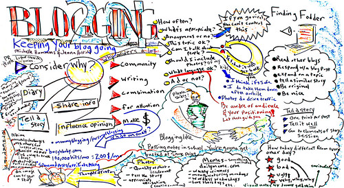

 

 
 
 
 
 
 
 

26/04/2020: [An informal benchmarking within psychometrics: attitude network approach vs. the general SEM framework using German national identity as an example](blog_2020_04_26.html)

02/12/2019: Ultra-short version of Collective Narcissism Scale for the [Prejudice Lab at Goldsmiths, University of London](https://collectivenarcissism.com/){target="_blank"}. Pdf version [here](https://collectivenarcissism.com/blog/3item_cns){target="_blank"}; HTML version [here](PODETR_IRT_data.RData.html).

09/06/2019: [Juxtaposing psychometrics, topic modeling, and social network analysis to model competing nationalist discourses](blog_2019_06_09.html)

16/04/2019: [semtree vs. network tree](blog_2019_04_16.html)
