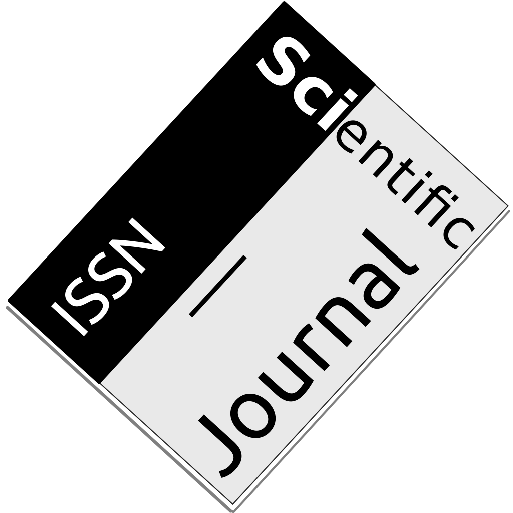

 

 
 
 
 
 
 
 

* __Articles in Refereed Journals__
    * Ponizovskiy, V., Ardag, M.M., Grigoryan, L., Boyd, R., Dobewall, H. & Holtz P. (2020) Development and validation of the Personal Values Dictionary: A theory-driven tool for investigating references to basic human values in text *European Journal Of Personality* 34(5), 885–902 [https://doi.org/10.1002/per.2294](https://doi.org/10.1002/per.2294){target="_blank"}
    * Ardag, M.M., Thomeczek, J.P. (2020 (forthcoming)). How many different types of populists are there in Germany? An experimental approach with multiple methods, *Journal of Theoretical Social Psychology* [https://doi.org/10.1002/jts5.70](https://doi.org/10.1002/jts5.70){target="_blank"}
    * Ardag, M.M., Castanho Silva, B., Thomeczek, J.P., Bandlow-Raffalski, S.F. & Littvay, L. (2020). Populist Attitudes and Political Engagement: Ugly, Bad, and Sometimes Good? *Representation* 56(3) 307-330. [https://doi.org/10.1080/00344893.2019.1661870](https://doi.org/10.1080/00344893.2019.1661870){target="_blank"}
    * Wuthrich, F.M. and Ardag, M.M. and Ugur, D. (2012). Politics, Cultural Heterogeneity and Support for the European Union in Turkey, *Southeast European and Black Sea Studies* 12(1), 45-62. [http://dx.doi.org/10.1080/14683857.2012.661221](http://dx.doi.org/10.1080/14683857.2012.661221){target="_blank"}

* __Non Peer-Reviewed Articles__
    * Ardag, M.M., Cohrs, J.C. & Selck, T.J. (2019) A Multi-Method Approach to National Identity: From Individual Level Attachment to National Attachment http://dx.doi.org/10.2139/ssrn.3321204
       FROM THE DOCTORAL DISSERTATION
    * Ardag, M. M., Cohrs, J.C. & Selck, T.J. (2017) Short Report on the European Union, Refugees and National Identity in Germany https://doi.org/10.13140/rg.2.2.17105.12649

      
* __Ph.D. Dissertation__
    * Ardag, M.M. (2018). _[National Identity: Conceptualization and Measurement, Antecedents and Consequences - An Exploration of the Sources of Heterogeneity.](http://oops.uni-oldenburg.de/3635/ ){target="_blank"}_ CvO University of Oldenburg, Oldenburg. Retrieved from [http://oops.uni-oldenburg.de/3635/](http://oops.uni-oldenburg.de/3635/){target="_blank"}

* __Work in Progress (including conference papers; excluding articles under review)__
    * Schachner, M., Ardag, M.M., Holtz, P., Grosser, J., Hartz, C., Boehnke, K., Dobewall, H. (2020) Development and validation of the Organizational Culture and Practices Dictionary (OCPD)
     ABSTRACT ACCEPTED TO IACCP ANNUAL MEETING 2020 (POSTPONED TO 2021)